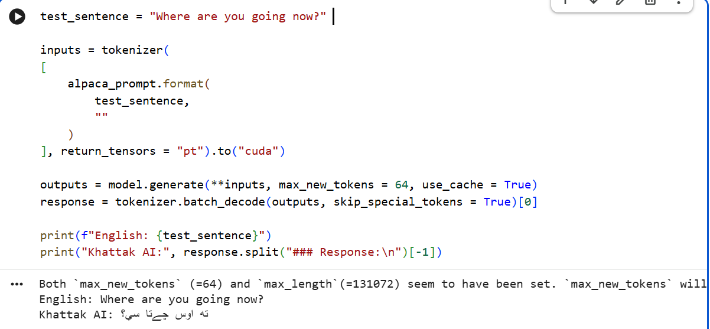

# Khatta-ka AI: Khattak Dialect Pashto LLM 🏔️

The world's first AI language model fine-tuned specifically to understand and generate the **Khattak dialect** of the Pashto language. 

Standard Pashto AI models often fail to capture the rich, localized grammar and vocabulary of rural dialects. This project bridges that gap by fine-tuning a base Pashto LLM to speak exactly like a native from the Khattak tribe regions (Karak, Nowshera, Kohat).

## 📸 Model in Action
*(Here is the AI successfully translating English into pure Khattak Pashto)*



## 🚀 Why This Matters
Standard Pashto models use Peshawari or Kandahari dialects. This model was specifically trained to recognize unique Khattak linguistic markers:
* **Future Tense:** Uses `بو` (bo) instead of standard `به` (ba). *(e.g., زه بو سبو چار کاون)*
* **Possession:** Uses `مو والا` (mo wala) instead of standard `زما` (zama).
* **Vocabulary:** Uses pure Khattak words like `استر` (astr - big), `کسو` (kso - bad/dirty), and `سبو` (sabo - tomorrow).
* **Gendered Adjectives:** Perfectly adapts feminine/masculine rules unique to the dialect (e.g., `ستره` vs `استر`).

## 🛠️ How It Was Built
* **Base Model:** `junaid008/qehwa-pashto-llm` (Qwen2 architecture)
* **Framework:** [Unsloth](https://github.com/unslothai/unsloth) for 2x faster LoRA fine-tuning.
* **Dataset:** A custom-built, highly curated dataset of English-to-Khattak sentence pairs focusing on everyday conversation, grammar rules, and local idioms.
* **Hardware:** Trained on a single Tesla T4 GPU via Google Colab.

## 💻 How to Use the Model

You can load this model directly from Hugging Face using Unsloth or Transformers:

```python
from unsloth import FastLanguageModel

# Load the Khattak Model
model, tokenizer = FastLanguageModel.from_pretrained(
    model_name = "adrainbialon/Khatta-ka",
    max_seq_length = 2048,
    load_in_4bit = True,
)
FastLanguageModel.for_inference(model)

# Format the prompt
prompt = """Below is an instruction. Write a detailed response in Pashto.
### Instruction:
I will do the work tomorrow.
### Response:
"""

inputs = tokenizer([prompt], return_tensors = "pt").to("cuda")
outputs = model.generate(**inputs, max_new_tokens = 64, use_cache = True)
response = tokenizer.batch_decode(outputs, skip_special_tokens = True)[0]

print(response.split("### Response:\n")[-1])
# Output: زه بو سبو چار کاون
