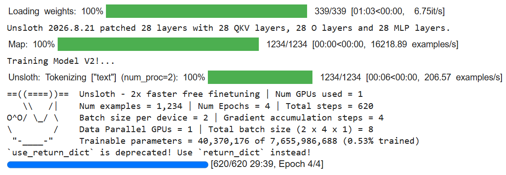
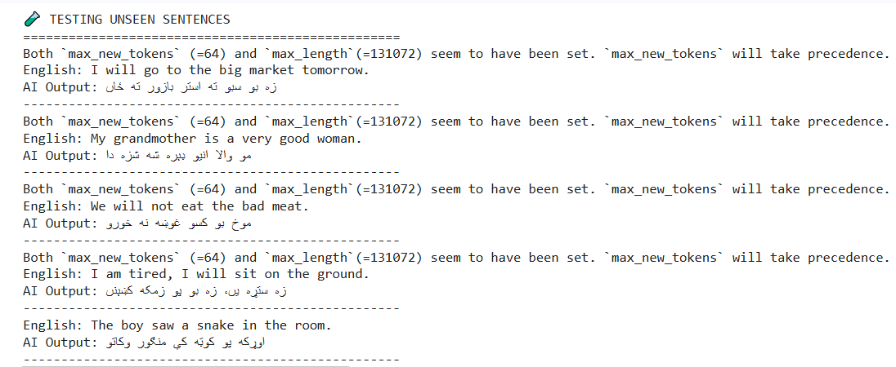

# Khatta-ka AI: Khattak Dialect Pashto LLM 🏔️

**[Read the Full Engineering Case Study on my Portfolio](https://www.mzubair.online/projects/khatta-ka-llm
)** | **[View Model on Hugging Face](https://huggingface.co/Muhammad-Zubair796/Khatta-ka)**

The world's first AI language model fine-tuned specifically to understand and generate the **Khattak dialect** of the Pashto language. 

Standard Pashto AI models often fail to capture the rich, localized grammar and vocabulary of rural dialects. This project bridges that gap by fine-tuning a base Pashto LLM to speak exactly like a native from the Khattak tribe regions (Karak, Nowshera, Kohat).

## 📸 Model in Action
*(Here is the AI successfully translating English into pure Khattak Pashto on unseen test sentences)*



## 🚀 Why This Matters
Standard Pashto models use Peshawari or Kandahari dialects. This model was specifically trained to recognize unique Khattak linguistic markers:
* **Future Tense:** Uses `بو` (bo) instead of standard `به` (ba). *(e.g., زه بو سبو چار کاوں)*
* **Possession:** Uses `مو والا` (mo wala) instead of standard `زما` (zama).
* **Vocabulary:** Uses pure Khattak words like `استر` (astr - big), `کسو` (kso - bad/dirty), and `سبو` (sabo - tomorrow).
* **Gendered Adjectives:** Perfectly adapts feminine/masculine rules unique to the dialect (e.g., `ستره` vs `استر`).

## 🛠️ How It Was Built
* **Base Model:** `junaid008/qehwa-pashto-llm` (Qwen2 architecture)
* **Framework:** [Unsloth](https://github.com/unslothai/unsloth) for 2x faster LoRA fine-tuning.
* **Dataset:** A custom-built, highly curated dataset of 1,234 English-to-Khattak sentence pairs focusing on everyday conversation, grammar rules, and local idioms.
* **Hardware:** Trained on a single Tesla T4 GPU via Google Colab.

## 📈 Training Performance
The model was trained for 4 epochs (620 steps). The training loss steadily and successfully decreased from **3.44** down to **0.22**, indicating excellent adaptation to the Khattak dataset without overfitting.



<details>
<summary><b>Click here to view the full Training Loss History</b></summary>

| Step | Training Loss |
| :--- | :--- |
| 10 | 3.447874 |
| 20 | 2.150129 |
| 30 | 1.407591 |
| 40 | 1.039266 |
| 50 | 0.920436 |
| 60 | 0.834459 |
| 70 | 0.821306 |
| 80 | 0.715990 |
| 90 | 0.718809 |
| 100 | 0.638106 |
| 110 | 0.604851 |
| 120 | 0.559561 |
| 130 | 0.577652 |
| 140 | 0.525185 |
| 150 | 0.497480 |
| 160 | 0.513509 |
| 170 | 0.400574 |
| 180 | 0.392234 |
| 190 | 0.430440 |
| 200 | 0.397762 |
| 210 | 0.416910 |
| 220 | 0.399505 |
| 230 | 0.420360 |
| 240 | 0.382605 |
| 250 | 0.393253 |
| 260 | 0.389418 |
| 270 | 0.429069 |
| 280 | 0.356388 |
| 290 | 0.377030 |
| 300 | 0.398721 |
| 310 | 0.377821 |
| 320 | 0.273812 |
| 330 | 0.269704 |
| 340 | 0.276601 |
| 350 | 0.283776 |
| 360 | 0.305166 |
| 370 | 0.272352 |
| 380 | 0.310798 |
| 390 | 0.280581 |
| 400 | 0.276446 |
| 410 | 0.297413 |
| 420 | 0.286290 |
| 430 | 0.282724 |
| 440 | 0.306337 |
| 450 | 0.285896 |
| 460 | 0.278556 |
| 470 | 0.269478 |
| 480 | 0.245348 |
| 490 | 0.229646 |
| 500 | 0.228311 |
| 510 | 0.221181 |
| 520 | 0.246099 |
| 530 | 0.227797 |
| 540 | 0.233362 |
| 550 | 0.222423 |
| 560 | 0.222264 |
| 570 | 0.226506 |
| 580 | 0.230401 |
| 590 | 0.227558 |
| 600 | 0.233159 |
| 610 | 0.228642 |
| 620 | 0.224542 |

</details>


## 💻 How to Use the Model

You can load this model directly from Hugging Face using Unsloth or Transformers:

```python
# 1. Install Unsloth
!pip install "unsloth[colab-new] @ git+https://github.com/unslothai/unsloth.git"
!pip install --no-deps xformers trl peft accelerate bitsandbytes datasets pandas

# 2. Now run the test script!
from unsloth import FastLanguageModel
import torch

print("\nLoading Khatta-ka AI...")
model, tokenizer = FastLanguageModel.from_pretrained(
    model_name = "Muhammad-Zubair796/Khatta-ka", # <--- FIXED THIS TO YOUR MODEL
    max_seq_length = 2048,
    dtype = None,
    load_in_4bit = True,
)

# Enable Unsloth's 2x faster inference
FastLanguageModel.for_inference(model)

# 3. The Prompt Format
alpaca_prompt = """Below is an instruction. Write a detailed response in Pashto.

### Instruction:
{}

### Response:
"""

# 4. The 5 Brand New Test Sentences
test_sentences = [
    "I will go to the big market tomorrow.",
    "My grandmother is a very good woman.",
    "We will not eat the bad meat.",
    "I am tired, I will sit on the ground.",
    "The boy saw a snake in the room."
]

print("\n" + "="*50)
print("🧪 TESTING UNSEEN SENTENCES")
print("="*50)

# 5. Loop through and translate each sentence
for sentence in test_sentences:
    inputs = tokenizer(
    [
        alpaca_prompt.format(sentence, "")
    ], return_tensors = "pt").to("cuda")

    outputs = model.generate(**inputs, max_new_tokens = 64, use_cache = True)
    response = tokenizer.batch_decode(outputs, skip_special_tokens = True)[0]
    
    # Extract just the AI's response
    khattak_output = response.split("### Response:\n")[-1].strip()
    
    print(f"English: {sentence}")
    print(f"AI Output: {khattak_output}")
    print("-" * 50)
